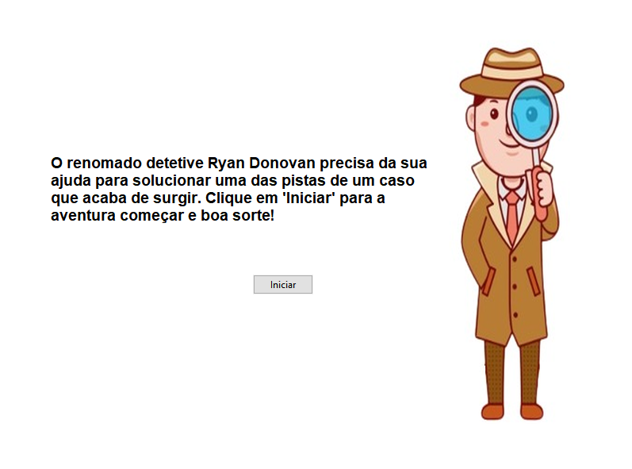
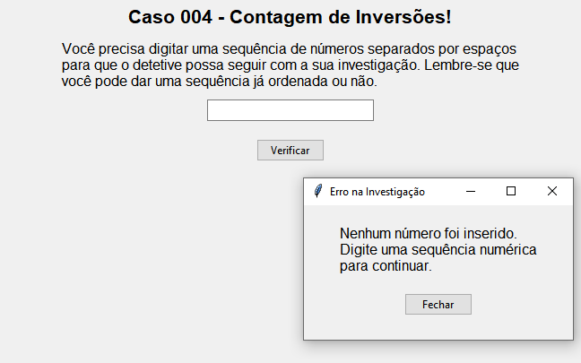
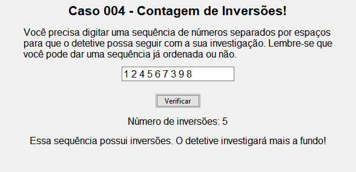

# Missão Secreta

**Conteúdo da Disciplina**: Dividir e Conquistar <br>

## Aluna
|Matrícula | Aluna |
| -- | -- |
| 20/2046040  |  Dara Maria Barbosa de Sousa  |
| 20/0041606  |  Marina Márcia Costa de Souza |

## Sobre 
O projeto consiste em uma interface gráfica e interativa que permite ao usuário inserir uma sequência numérica, separada por espaços, que pode estar ou não ordenada. Utilizando a técnica de ordenação conhecida como Merge Sort, o programa conta o número de inversões presentes na sequência de números. Para realizar essa tarefa, o projeto implementa as funções merge_sort, merge e count_inversions.

## Screenshots




## Instalação  
**Linguagem**: Python 3.7.9 <br>
**Framework**: Tkinter

Uma vez que o python for instalado, execute o comando abaixo para instalar as dependências:

```cli
pip install tkinter 
````

Depois:

```cli
pip intall Pillow
```

## Uso 
Para rodar o código, use o seguinte comando:

```cli
python main.py
```

## Outros 
- É crucial que o Python e o Pillow sejam intalados para realizar a execução do projeto;
- Se certifique de que o arquivo de imagem "detetive.png" esteja presente no mesmo diretório do código ou forneça o caminho correto para o arquivo de imagem, caso contrário, você pode encontrar um erro ao tentar executar o código.